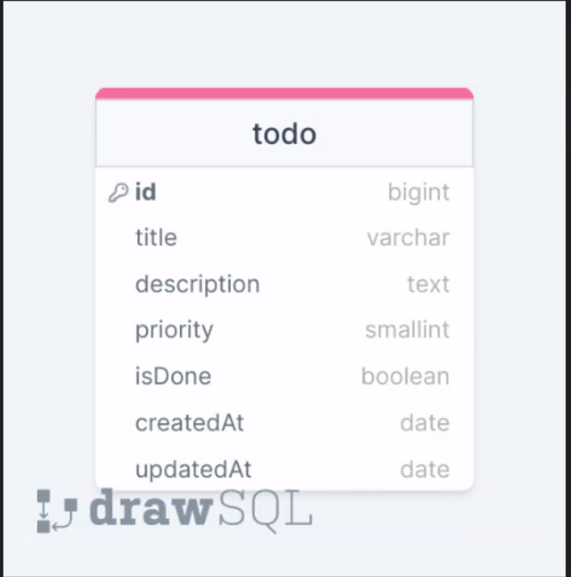

<a name="readme-top"></a>
 
 
<!-- PROJECT LOGO -->
<br />
<div align="center">
   
  <a href="https://github.com/ibrsec/tutortodo_app_backend">
    
  </a> 

  <h3 align="center">Backend of the Tutorial App</h3>

  <p align="center"> 
    An awesome Backend of the Tutorial App
    <!-- <a href="https://github.com/ibrsec/stock-app"><strong>Explore the docs »</strong></a> -->
    <br />
    <br />  
    <a href="https://github.com/ibrsec/tutortodo_app_frontend">Frontend Repo</a>
    ·
    <a href="https://tutortodo-app-frontend.vercel.app/">Frontend Live</a>
    ·
    <a href="https://github.com/ibrsec/tutortodo_app_backend/issues">Report Bug</a>
    ·
    <a href="https://github.com/ibrsec/tutortodo_app_backend/issues">Request Feature</a>
  </p>
</div>


<!-- TABLE OF CONTENTS -->
<details>
  <summary>📎 Table of Contents 📎 </summary>
  <ol>
    <li><a href="#about-the-project">About The Project</a></li>
     <!-- <li><a href="#figma">Figma</a></li> -->
     <li><a href="#overview">Overview</a></li>
     <li><a href="#quick-setup">Quick Setup</a></li>
     <li><a href="#directory-structure">Directory structure</a></li>
     <li><a href="#built-with">Built With</a></li>
    <!-- <li>
      <a href="#getting-started">Getting Started</a>
      <ul>
        <li><a href="#prerequisites">Prerequisites</a></li>
        <li><a href="#installation">Installation</a></li>
      </ul>
    </li>
    <li><a href="#usage">Usage</a></li>
    <li><a href="#roadmap">Roadmap</a></li>
    <li><a href="#contributing">Contributing</a></li>
    <li><a href="#license">License</a></li>
    <li><a href="#contact">Contact</a></li>
    <li><a href="#acknowledgments">Acknowledgments</a></li> -->

    
  </ol>
</details>


---

<!-- ABOUT THE PROJECT -->
<a name="about-the-project"></a>
## ℹ️ About The Project

<b>ERD:</b>
[](https://tutortodo-app-frontend.vercel.app/)
---


<p align="right">(<a href="#readme-top">back to top</a>)</p>


---

<!-- ## Figma 

<a href="https://www.figma.com/file/ePyCHKsx2ODB32uLgyUEEd/bootstrap-home-page?type=design&node-id=0%3A1&mode=design&t=edDzadCB9Ev5FS1a-1">Figma Link</a>  

  <p align="right">(<a href="#readme-top">back to top</a>)</p>


--- -->
<a name="overview"></a>
## 👀 Overview

📦 A Backend of Tutorial App Project</br>
🏀 [Frontend Repo](https://github.com/ibrsec/tutortodo_app_frontend) </br></br>

<b>🎯 Express.js Framework:</b> Developed a secure and efficient RESTful API with Express.js for managing tutorials, categories, and user data.</br> 

<b>📊 Database Management:</b> Leveraged MongoDB and Mongoose for robust data modeling, validation, and querying of tutorial information and user data.</br>

<b>🔄 CRUD Operations:</b> Implemented full CRUD functionality for managing tutorials ensuring seamless data operations and management.</br>

<b>🛠 Middleware & Error Handling:</b> Created custom middleware for input validation, CORS handling, and consistent error management throughout the API using express-async-errors.</br>

<b>🌐 Scalable Deployment:</b> Prepared for deployment on Vercel to ensure high availability and scalability.</br>


<p align="right">(<a href="#readme-top">back to top</a>)</p>


<a name="quick-setup"></a>
## 🛫 Quick Setup

```sh
# clone the project
git clone https://github.com/ibrsec/tutortodo_app_backend.git

# enter the project directory
cd tutortodo_app_backend

# install dependency
npm install 

# develop
npm run start 

```

<p align="right">(<a href="#readme-top">back to top</a>)</p>


<!-- ## 🐞 Debug

 -->


<a name="directory-structure"></a>
## 📂 Directory structure 

```diff
+ tutortodo_app_backend  (folder)     

+     |---src (folder) 
      |     |---config (folder)       
      |     |           
      |     |---controller (folder) 
      |     |    
      |     |---middlewares (folder)      
      |     |          
      |     |---helpers (folder)      
      |     |          
      |     |---models (folder)           
      |     |          
      |     └---routers (folder)  
      |      
      |----swagger (folder) 
      |----.env
      |----index.js
      |----.gitignore
      |----package.json
      |----vercel.json
      └----readme.md 
```

<p align="right">(<a href="#readme-top">back to top</a>)</p>

---

<a name="built-with"></a>
### 🏗️ Built With


<!-- https://dev.to/envoy_/150-badges-for-github-pnk  search skills-->

 
   
  
  
  
  
 <!--   -->
 <!--   -->
  

 <!--   -->
  
  
  
 

  

